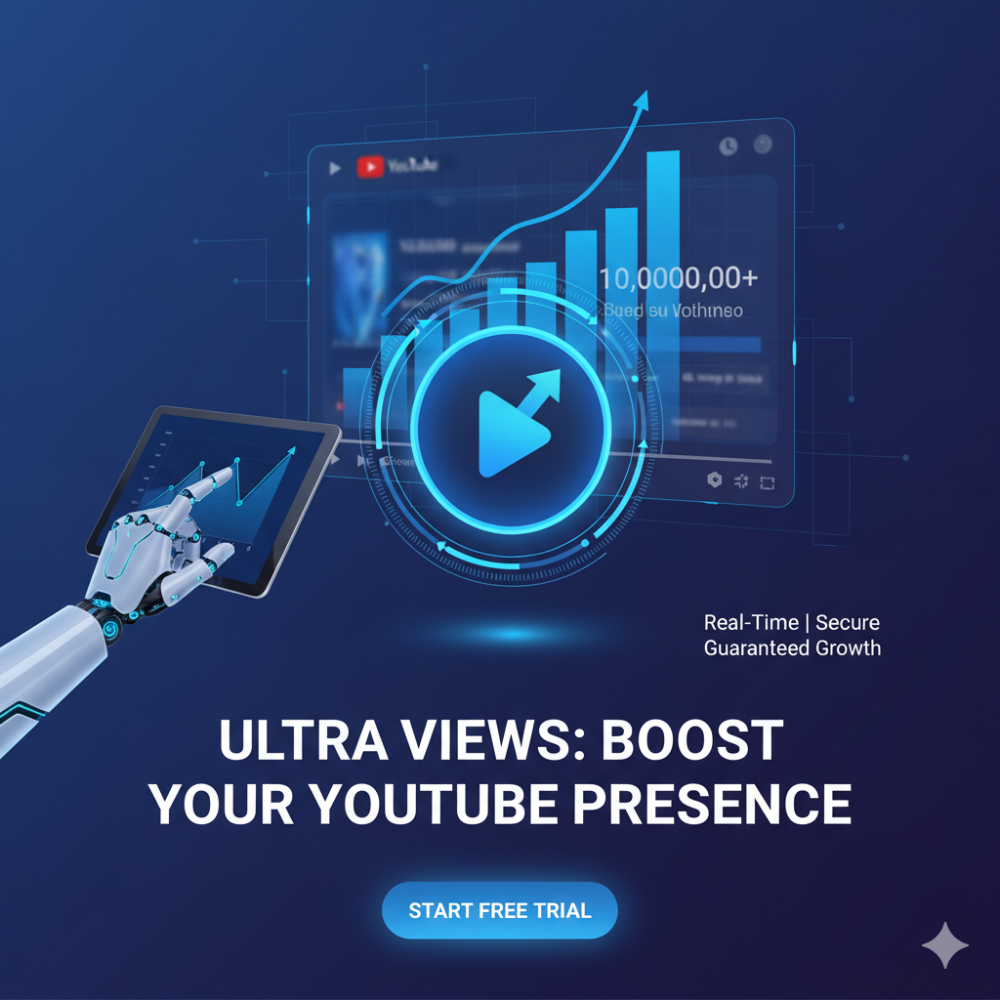
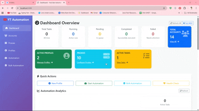

# youtube-views-bot  

Automated solution for simulating YouTube views at scale.  
Designed for testing, research, and educational purposes, this toolkit helps developers understand YouTube’s behavior, proxies, and automation flows.  

<p align="center"> 
  <a href="https://github.com/yourusername/youtube-view-bot">
    
  </a> 
</p>

<p align="center">
  <a href="https://discord.gg/vBu9huKBvy">
    
  </a>
  <a href="https://t.me/devpilot1">
    
  </a>
</p>

---

##  Introduction  

The **youtube-view-bot** is a research automation project to simulate YouTube traffic patterns.  
It’s built for developers and testers who want to study YouTube’s engagement flows, proxy rotation, and multi-instance management.  

###  Key Benefits  
- **Time-Saving** → Automates repetitive tasks like refreshing and watching videos.  
- **Scalable** → Run multiple sessions with rotating proxies and accounts.  
- **Safer Testing** → Designed with anti-detect browsers and sandboxing to reduce risk.  

---

<p align="center">
  
</p>


<p align="center">
  <a href="https://www.loom.com/share/b7734cf1455f4c018e469ee18a821c72" target="_blank" rel="noopener noreferrer">
    
  </a>
</p>
<p align="center">
  <a href="https://www.loom.com/share/b7734cf1455f4c018e469ee18a821c72" target="_blank" rel="noopener noreferrer">
    Click here to see the demo video
  </a>
</p>

##  Features  
- Automated YouTube video view generation  
- Proxy support (residential, datacenter, mobile)  
- Headless & visible browser automation (Playwright/Selenium)  
- Randomized watch times & intervals for natural behavior  
- Multi-session control (parallel execution)  
- Configurable via `.env`  
- Docker-ready for deployment  

---

##  Use Cases  
- Load testing YouTube video pages  
- Studying engagement metrics and retention  
- Research on proxy & browser fingerprinting  
- Demonstration of automation flows in social media apps  

---

##  Contact  

<p align="center">
  <a href="https://discord.gg/vBu9huKBvy">
    
  </a>
  <a href="https://t.me/devpilot1">
    
  </a>
</p>

---

##  Installation  

###  Pre-requisites  
- Python **3.9+** or Node.js **18+**  
- Playwright / Selenium  
- Docker (optional)  

###  Steps  

```bash
# Clone repo
git clone https://github.com/yourusername/youtube-view-bot
cd youtube-view-bot

# Python Install
pip install -r requirements.txt

# OR Node Install
npm install

# Copy config
cp .env.example .env

# Run (Python)
python main.py

# Run (Node)
node index.js

# Run with Docker
docker build -t youtube-view-bot .
docker run --env-file .env youtube-view-bot
